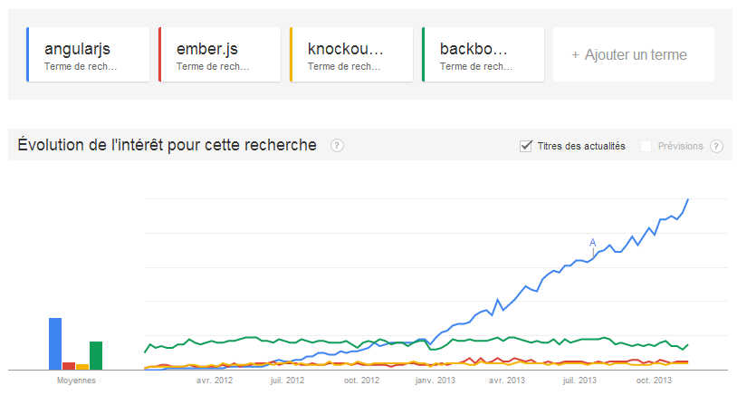
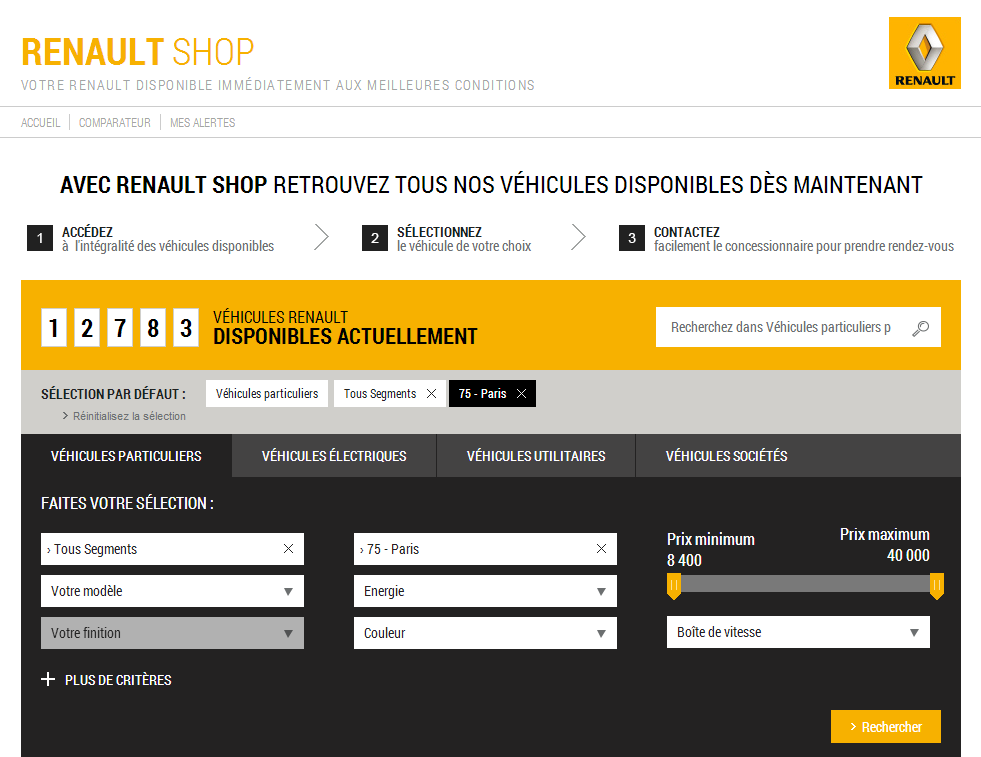
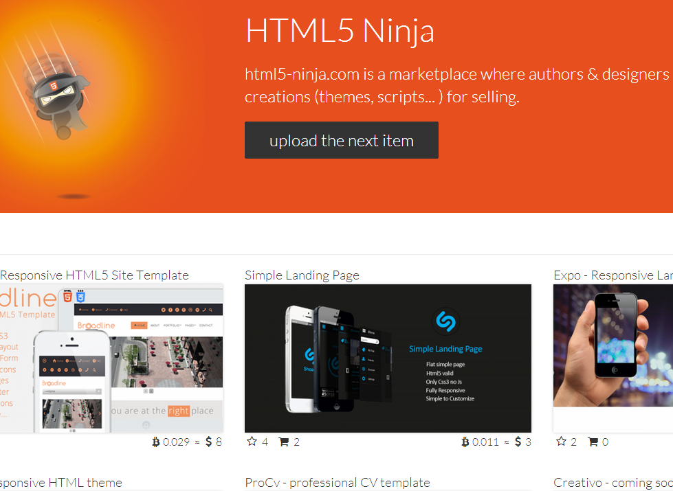
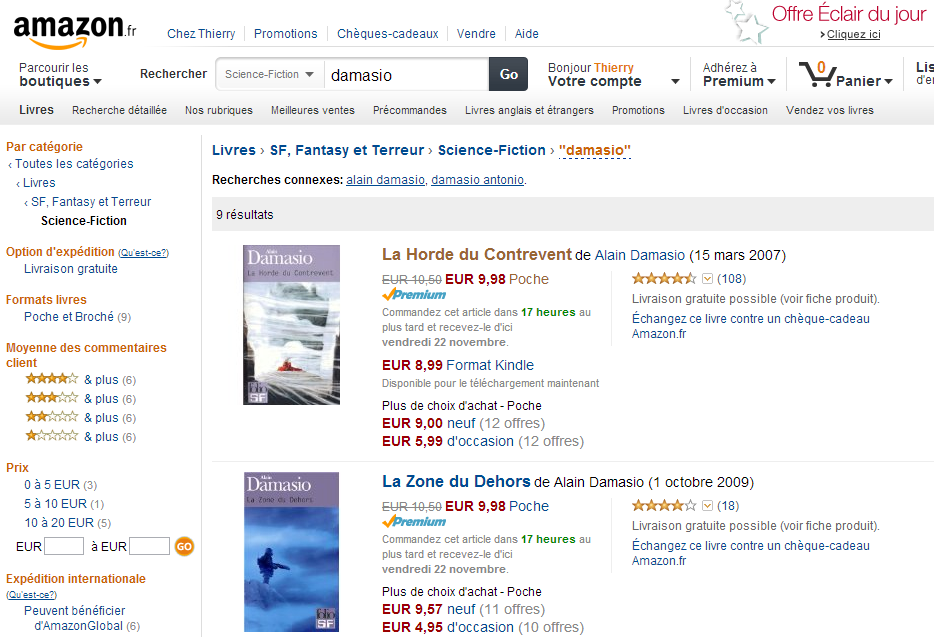

!SLIDE ====================================================================================

#  _1 an après..._

!SLIDE bullets small moi ============================

<table>
<tr><td></td><td>Thierry Chatel  </td></tr>
</table>

* Consultant indépendant
    * architecture des applications web
* Formateur AngularJS & JavaScript

 
<table id="reseaux">
<tr>
<td>tchatel@gmail.com</td>
<td>@ThierryChatel</td>
<td>+ThierryChatel</td>
<td>tchatel</td>
</table>

 

!SLIDE subsection ====================================================================================

# AngularJS

!SLIDE bullets ============================

# Chronologie

* 13 juin 2012 : AngularJS 1.0.0
* branche 1.1 _'lab'_
    * support des animations
* 8 novembre 2013 : AngularJS 1.2.0

!SLIDE image ============================

### encore en phase _"early adopters"_

!SLIDE bullets ============================

# Utilisation

* entreprises de toutes tailles
* bons retours d'expérience
* surtout pour des applications internes
* peu d'applications publiques en production

!SLIDE ======================

!SLIDE ======================

!SLIDE ======================

!SLIDE subsection ===================

# retours d'expérience

!SLIDE ============================

# remplacement de Flex

 

!SLIDE bullets =====================

# choix stratégique

* petit prototype... concluant
* aspects convaincants
    * data binding
    * templates HTML
    * peu de code
* vision très partielle

!SLIDE bullets ======================

# pas si simple

* comment structurer une vraie application ?
* mauvaises pratiques
    * code métier dans les contrôleurs
    * règles métiers dans les templates
    * sous-utilisation des services
    * gros refactoring à prévoir

!SLIDE bullets =====================

# pas facile

* trouver les solutions simples
    * ex: mettre un contrôleur dans un `ngRepeat`
    * ex: services pour conserver les données
    * ex: mauvaise utilisation des événements du scope
    * ex: mauvaise utilisation du `ngChange`

!SLIDE bullets ====================

# quel public ?

* plus facile pour les développeurs
    * Flex
    * JSF
* plus complexe pour les développeurs jQuery
    * habitudes à désapprendre

!SLIDE bullets ====================

# AngularJS et l'existant

* intégrable dans une application existante
    * un `
` contenant une appli AngularJS
* ex: dans une appli PHP + Prototype
* ex: dans une appli SharePoint (!)

!SLIDE subsection ===============================

# présentation côté client

!SLIDE bullets ======================

# Avantages

* application plus réactive
* architecture plus simple
* serveur(s) REST stateless
* support de différents clients
    * web
    * mobiles
* montée en charge simplifiée

!SLIDE subsection  ======================

# en JavaScript natif
## (et peu de code)

!SLIDE bullets ======================

# Avantages

* pas de plugin
* debug natif
* plate-forme HTML (étendue)
    * on développe vraiment en HTML + JS + CSS
    * mais un HTML métamorphosé
    * c'est très agréable !

!SLIDE subsection ===============================

# le futur

!SLIDE bullets ======================

# Avantages

* bientôt : Protractor (tests E2E)
* en cours : AngularDart
* un jour : WebComponents,  
   &nbsp;&nbsp;&nbsp;&nbsp;&nbsp;&nbsp;&nbsp;&nbsp;&nbsp; convergence avec Polymer

!SLIDE bullets ======================

# Polymer.js

* AngularJS s'appuiera sur Polymer.js
    * comme il s'appuie sur jQuery
* support natif sur les navigateurs récents
* ou polyfills sur les anciens

!SLIDE subsection ====================================================================================

# sites publics ?

!SLIDE bullets ============================

# sites publics

* applications ouvertes au public
* sites e-commerce
* CMS

!SLIDE image ============================

!SLIDE image ============================

!SLIDE bullets ============================

# SEO

* générer des pages brutes par du code serveur
    * sorte de sitemap pour les crawlers
* ou faire tourner l'appli côté serveur et enregistrer les pages

